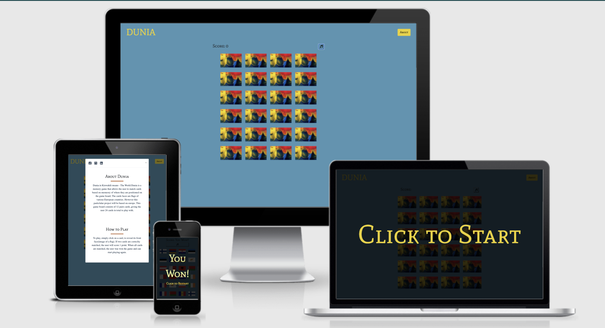
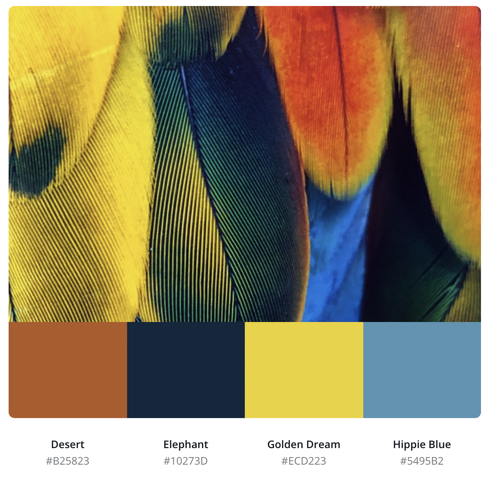
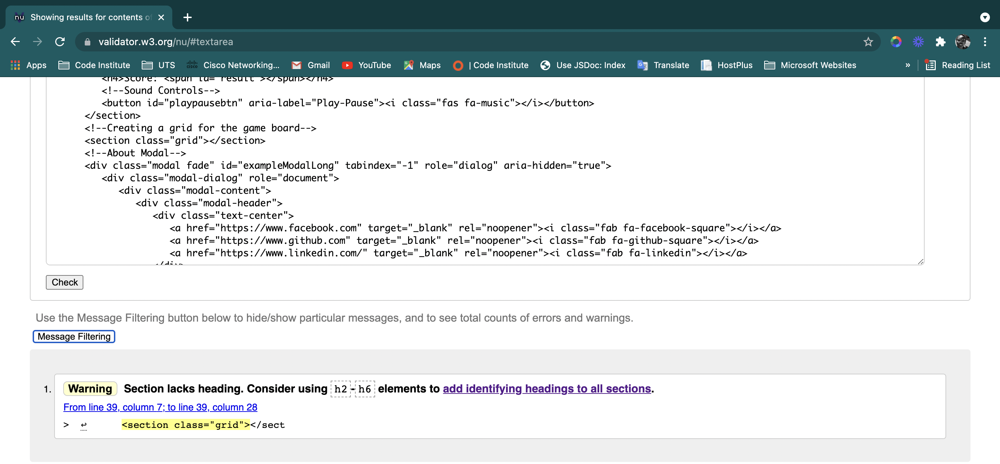
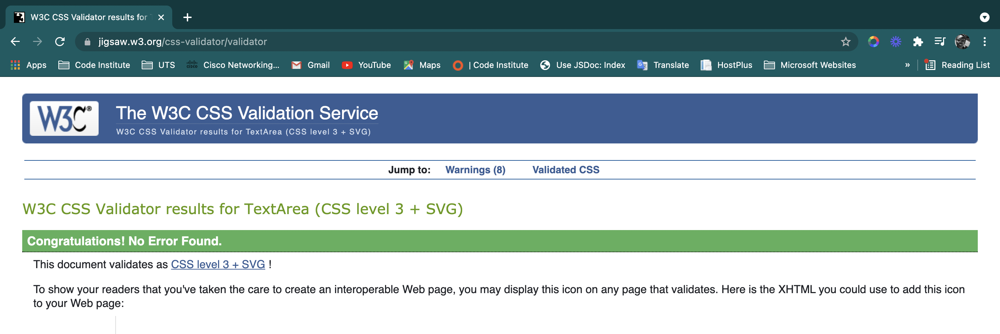
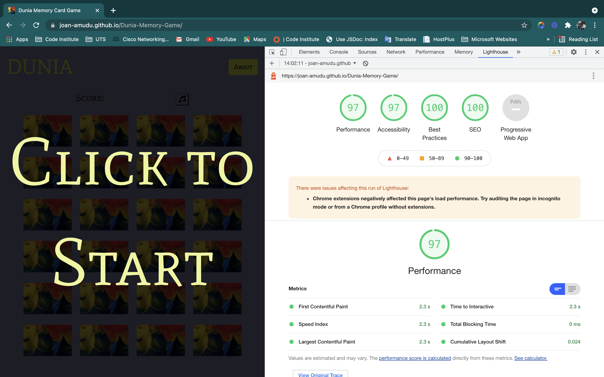
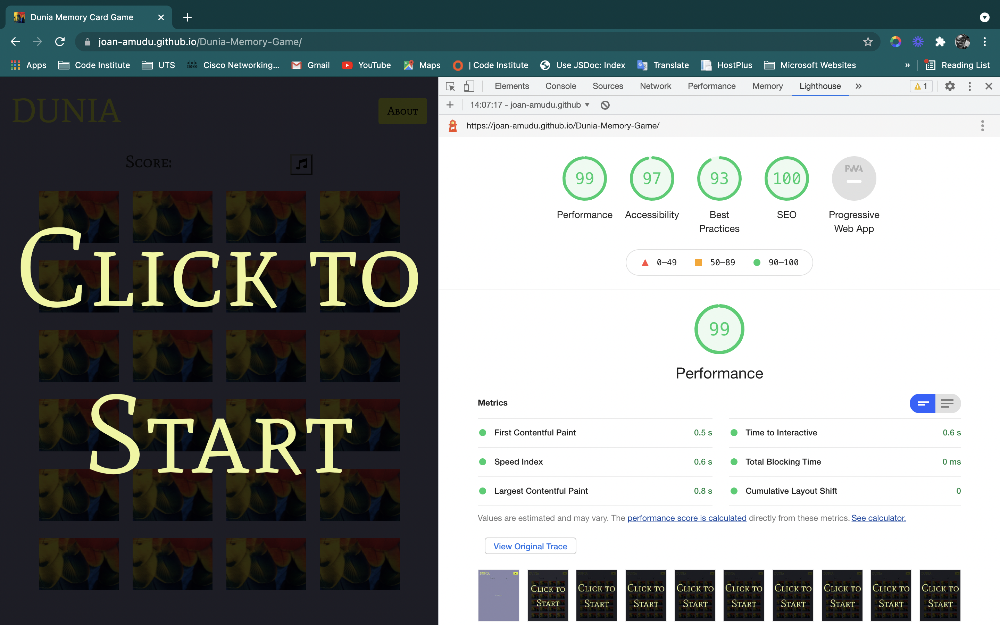

# DUNIA


The deployed site can be found [here](https://joan-amudu.github.io/Dunia-Memory-Game/)

# Table of Content
[General Information](#general-information)

[How to Play](#how-to-play)

[User Experience](#user-experience)

[Features](#features)

[Technologies](#technologies)

[Testing](#testing)

[Deployment](#deployment)

[Credits](#credits)

[Acknowledgements](#acknowledgements)

# General Information
## About
Dunia in Kiswahili means - The World. The idea behind this memory game was inspired from my love for travelling.

The game is based on matching flags of european countries. 
## How to Play
* To play, simply click on a card to reveal the flag and find a match. Once the user matches 2 identical flags, 1 point is scored. 
* To win the game, simple match all 12 flags.
* To play again, click on the Restart Game button and the card deck will be shuffled.

#### [Back to top](<#table-of-content>)

# User Experience 
This section highlights the user experience, design, fonts and color scheme used to provide a seemless user experience.

## User Stories
* As a player I want to quickly know what the game is about.
* As a player, I want instructions on how to play the game, so that I know what to expect.
* As a player I want to see my progress through a scoreboard.
* As a player, I want to be able to mute/unmute any sounds


## Design 
The webiste's design and layout is based on fonts, colors, wireframes, images and icons.

### Fonts
* [Google Fonts](https://fonts.google.com/) was imported to CSS with the Mate SC font family being the main font for the body and playfair font for the paragraphs.

### Color Scheme

This color palette was inspired and generated from the backface image of the cards.
* **#B25823 (Desert):** Used for the < hr > HTML element. 
* **#10273D (Elephant):** Used for socila media icons and paragraph text.
* **#ECD223 (Golden Dream):** Used for the Brand name, About button and overlay texts.
* **#5495B2 (Hippie Blue):** Used as the background color.



### Wireframes
* Wireframes were created using the [Balsamiq](https://balsamiq.com/wireframes/) software.

* A pdf of the wireframes can be found [here](/Assets/Wireframes/Dunia-Memory-Game.pdf). This file can also be downloaded from Github. (**Please Note:** _[Adobe Acrobat Reader](https://get.adobe.com/reader/) is required to view files in pdf format_).

#### [Back to top](<#table-of-content>)

# Features
The website incorparates a navigation bar with a brand name and a button as a menu item on the left. 

It aslo consists of a landing page with over-lay text which are fully responsive.

### **Existing Features**

Included in the **Landing** page is:

* **An ovelay text - Click to start:** This prompts the player to click and start the game. Clicking the overlay text alos reveals the Nav bar with the Brand Name and About Modal button and the card deck with scoreboard 

* **Navigation Bar:** Fully responsive navbar will expand outside of smaller devices and overall provides a user friendly and intuitive browsing experience.

* **About Button** : This is a Modal with right-aligned social media icons (Facebook, GitHub, LinkedIn). These icons are links to the respective social media pages and will open in a new tab to maintain user retention.
The **Modal** also has content about the game and how to play it.


### **Nice to have Features**
These are features that would have been hice to have as they would have an added value for the player. These features will aslo be implemented in the future.

* **A timer**: This timer wouls start counting when the user clicks the first card when starting the game. In addition, a **Count-down timer**, where the time is predefined for the user and the user either wins the game within that set time or will lose and a **game-over** overlay text will be displayed.
* **Timer controls**: To give the player more control, the timer would have an on/off functionality, allowing them to choose to play a timed game or a more relaxed game without the timer counting down, thus allowing them to get more familiar with the game and give them higher chances of winning.
* **Difficulty levels**: This would include easy, medium and hard levels of difficulty.
* **Additional Music**: This would include a game-over music, and would apply when the **Count-down timer** is chosen. The **game-over** music will be activated when the **Count-down timer** has ended indicating that the player has lost the game.
To add to the user experience, a joyful **Victory** music when the player has won the game, along with the accompanying overlay text. 

#### [Back to top](<#table-of-content>)  
 
# Technologies
This project is created with:
* HTML5 - used for building the website.
* CSS3 - for styling elements.
* JacaScript - used to make the web page more interactive.
* Google Fonts - Mate Sc and Playfair.
* Bootstrap - to customise the site as a responsive mobile-first site.
* Font Awesome - for Icons.
* Balsamic - to creation of the Wireframes.
* GitHub - Used for hosting the code and version control.
* GitHub Pages - This is where the site is deployed.

#### [Back to top](<#table-of-content>)

# Testing 

## Functional Testing
This detailed testing is done to ensure that the differrent aspects of the application work as intended. 


Test Case | Action | Expected Result | Pass/Fail | Comments 
---------------|---------------|---------------|---------------|---------------
TC001 |Clicking Ovelay Text| Clicking the "Click to Start" text will display the landin page with Nav bar and card deck | Pass
TC002 |Clicking Ovelay Text| When the play Clicks the "Click to Start" background music should start playing | Pass | The speaker favicon will be displyed on browser to show that the current tab is playing an audio
TC003 |Clicking Brand Name| The Brand name - Dunia, when clicked should return the user to the home page and can also be used to restart the game| Pass 
TC004 |About Button| When the player click the About button, a Modal will be displayed| Pass
TC005 |Hovering over facebook icon from Modal| The facebook HTTP link should be displayed from the bottom right of the page| Pass
TC006 |Clicking facebook icon from Modal| The link should open in a new tab| Pass | Users must have a facebook account in order to login, or register for one. 
TC007 |Hovering over github icon from Modal| The github HTTP link should be displayed from the bottom right of the page| Pass
TC008 |Clicking github icon from Modal| The link should open in a new tab| Pass | github repositories can be viewed without a user account, however it is advisable to have one 
TC009 |Hovering over Linkedin icon from Modal| The Linkedin HTTP link should be displayed from the bottom right of the page| Pass
TC0010 |Clicking Linkedin icon from Modal| The link should open in a new tab| Pass | Users must have a Linkedin account in order to login, or register for one. 
TC0011 |Clicking on a card| This action should flip the card and reveal the frontface flag image| Pass
TC0012 |Clicking on a second card| This action should flip the card and reveal the frontface flag image, so 2 cards will be revealed simultaneously | Pass
TC0013 |Clicked cards are a match| When both cards are a match, a score will be recored against the score label on the scoreboard | Pass
TC0014 |Clicked cards are not a match| If cards a not a match, after a 500ms timeout, they will flip back and backface image will be shown giving the user a chance to play those cards again| Pass
TC0015 |Clicking a card twice| This flip the card back and backface image will be shown| Pass
TC0016 |Matching all cards| This should record a total of 12 on the score board and a "You Won" overlay displayed.| Pass
TC0017 |"You won" Over lay text| This should stop the background music| Pass
TC00418 |"Click to restart" small overlay text| clicking the text prompts the player to restart the game| Pass | The game will restart with the "Click to start" overlay text
TC0019 |Clicking the music Icon| This pause the music| Pass | The speaker favicon on browser will disappear, idicating that the current tab is not aplaying any audio
||


#### [Back to top](<#table-of-content>)

## Brower Compatitbility
This will be tested on the following browsers:
  - Google Chrome
  - Microsoft Edge
  - Firefox
  - Safari
  
## Responsiveness
The site was tested on different screen sizes with special attention to very small screens e.g. iPhone 5 and very large screens e.g. 5K iMac Pro (5120 x 2880 px).


## Testing User stories
* As a player I want to quickly know what the game is about.
This is achieved from the About button, which reveals a Modal containing information about the game and how to play it.
* As a player, I want instructions on how to play the game, so that I know what to expect.
This is achieved from the About button, which reveals a Modal containing information about the game and how to play it.
* As a player I want to see my progress through a scoreboard.
The scores are displayed against the score label. 1 score for each match, up to a total of 12 scores indocating that the player has won the game.
* As a player, I want to be able to mute/unmute any sounds
The Music icon button, when clicked, pauses the music. And when music is pause, the palyer ca click the button again to play the background music.

## Validators
**HTML Code** was passed through the **[W3C HTML Validator](https://validator.w3.org/ "W3C HTML Validator")**.
* Because the cards are appened to the grid via Javascript, a h2-h6 tag was not neccesariy as suggested in the HTML validator, and doesnot affect the functionality or responsiveness of the site.



**CSS Code** was passed through the **[W3C CSS Validator](https://jigsaw.w3.org/css-validator/ "W3C CSS Validator")**.




## Lighhouse Report  
### Mobile



### Desktop


#### [Back to top](<#table-of-content>)


# Deployment
This website was created in gitpod, which is linked to Github. All changes were commited and pushed to Github.

## GitHub Pages

The project was deployed to GitHub Pages using the following steps...

1. Log in to GitHub and locate the [GitHub Repository](https://github.com/Joan-Amudu/Dunia-Memory-Game).
2. At the top of the Repository (not top of page), locate the "Settings" Button on the menu.
3. Scroll down the Settings page until you locate the "GitHub Pages" Section.
4. Under "Source", click the dropdown called "None" and select "Master Branch".
5. Click save.
6. The page will automatically publish to GitHub pages. 
7. Scroll back down through the page to locate the now published site [link](https://joan-amudu.github.io/Dunia-Memory-Game/) in the "GitHub Pages" section.

### Forking

1. Login to your account on [Github](https://github.com/).
2. Locate the [Repository](https://github.com/Joan-Amudu/Dunia-Memory-Game) used for this project.
3. On the right-hand side of the Repository name, you'll see the 'Fork' button.
4. This will create a copy in your personal repository.
5. Once you're finished making changes, return to original repository and press 'New Pull Request' to request your changes to be merged into the original project.

### Making a Local Clone

1. Log in to GitHub and locate the [GitHub Repository](https://github.com/).
2. Under the repository name, click Code.
3. To clone the repository, select HTTPS and copy the link.
4. Open Git Bash.
5. Change the current working directory to the location where you want the cloned directory to be made.
6. Type **git clone**, and then paste the URL you copied in Step 3.

```
 git clone https://github.com/YOUR-USERNAME/YOUR-REPOSITORY
```
    * To clone this particular repository:
    git clone https://github.com/Joan-Amudu/Dunia-Memory-Game.git

7. Press Enter. Your local clone will be created.
8. Change into the directory being created.
9. Clicking index.html, opens the site in a browser.

Click [Here](https://help.github.com/en/github/creating-cloning-and-archiving-repositories/cloning-a-repository) for more information about cloning repositories.

#### [Back to top](<#table-of-content>)

# Credits
Below are the resources that were used to create this website.
## Code
* Javascript code and structure inspired by [Ania Kubrow](https://youtu.be/tjyDOHzKN0w) and [Port Exe](https://youtu.be/3uuQ3g92oPQ)

* JavaScript Audio Controls code snippet from [Adam Khoury.](https://youtu.be/hsSXzdn_0Gg)

* Click on the card twice would record a score. So to fix this, a solutuion  from [codepen](https://codepen.io/Fako29/pen/ZEOjyBV) was used. 
 
      * original code from line 98:

  ```javascript
  if (cardsSelected[0] === cardsSelected[1] && firstCard !== secondCard) 
  ```


## Images
Backface Image on cards by James Lee: [Pexels](https://www.pexels.com/photo/close-up-photo-of-feathers-2625664/).

All flag images are from [wikipedia Commons](https://commons.wikimedia.org/wiki/Main_Page) -  a free media repository.


[Albania](https://commons.wikimedia.org/wiki/File:Flag_of_Albania.svg)

[Andorra](https://commons.wikimedia.org/wiki/File:Andorra_Flag.svg)

[Armenia](https://commons.wikimedia.org/w/index.php?curid=342948)

[Austria](https://commons.wikimedia.org/w/index.php?curid=342954)
 
[Estonia](https://commons.wikimedia.org/w/index.php?curid=343044)

[Finland](https://commons.wikimedia.org/w/index.php?curid=343054)

[France](https://en.wikipedia.org/w/index.php?curid=33285388)

[Cyprus](https://commons.wikimedia.org/w/index.php?curid=433230)

[Croatia](https://commons.wikimedia.org/w/index.php?curid=433228)

[Ireland](https://commons.wikimedia.org/w/index.php?curid=343611)

[Belarus](https://commons.wikimedia.org/w/index.php?curid=75422931)


[Malta](https://commons.wikimedia.org/w/index.php?curid=433234)


## Other resources
* [w3schools.com](https://www.w3schools.com/default.asp): used for a deeper understanding of HTML and CSS.
* [StackOverflow](https://stackoverflow.com/): Used for troubleshooting. 
* Code Institute course modules.
#### [Back to top](<#table-of-content>)
# Acknowledgements
I would like to acknowledge my mentor Brian Macharia who guided me throughout the project. His professionalism and knowledge sharing approach and attitude are a great inspiration to me.

I would aslo like to acknowledge fellow Code Institute Students [Vanja Torp](https://github.com/VTwin90/Milestone-1-Portfolio) and [Ciaran Concannon](https://github.com/cjcon90/country-quiz/blob/main/README.md). Both their README files were greatly inspiring and well written. Through their full permission, this README document was structured according to theirs and my previous [project](https://github.com/Joan-Amudu/Amani-Kickboxing-Gym). 
#### [Back to top](<#table-of-content>)